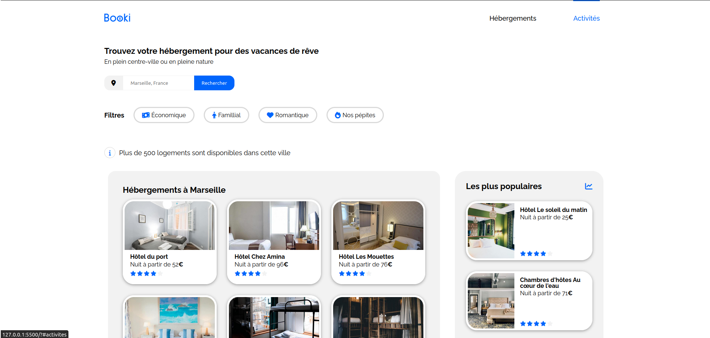
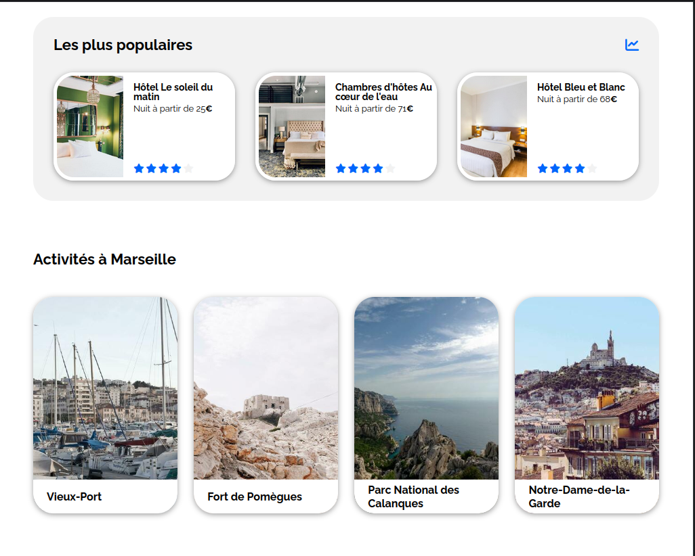
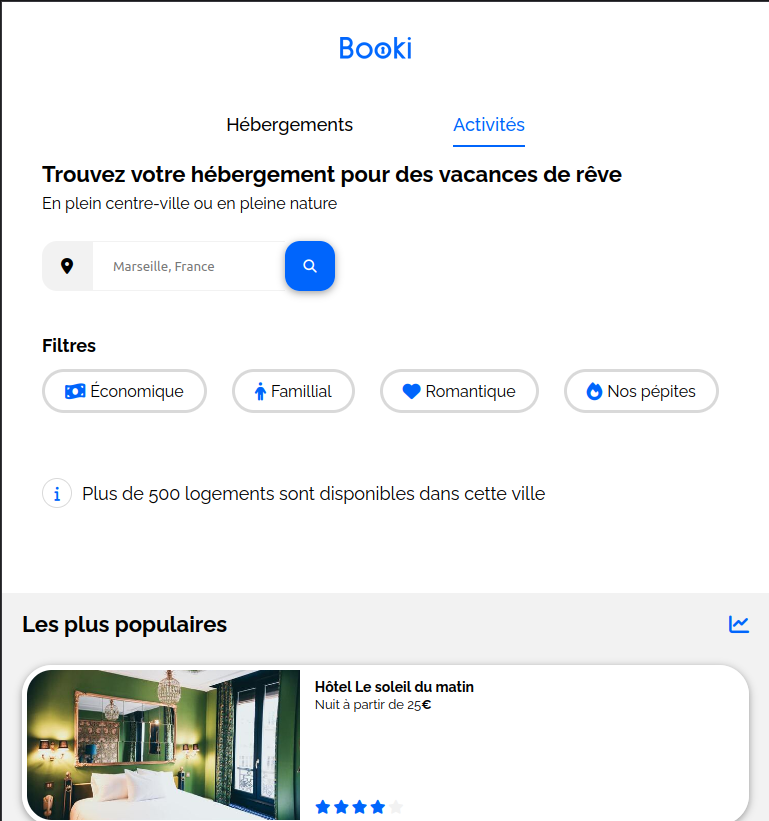
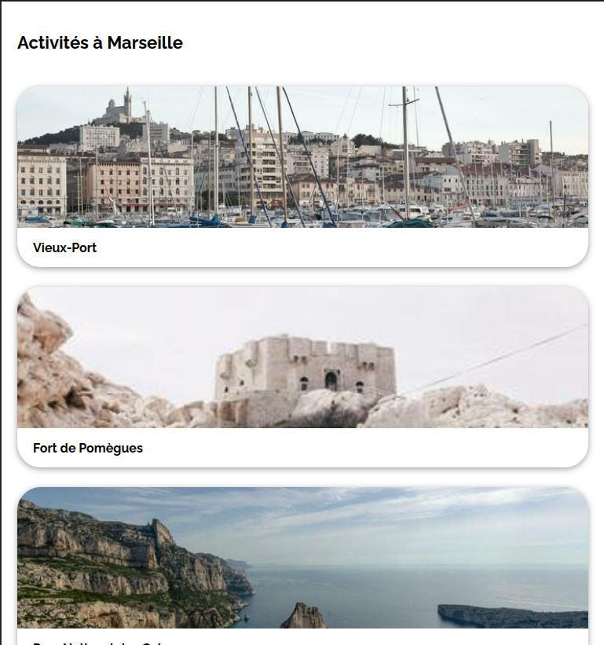

# booki_oc_project2

Projcet n°2 from opencalsrooms web developer courses.
For this project, we have to build the homepage of booking website by following a figma model using only HTML and CSS.
We have to start with the desktop version and then implementing the responsive design for tablets and mobiles.

